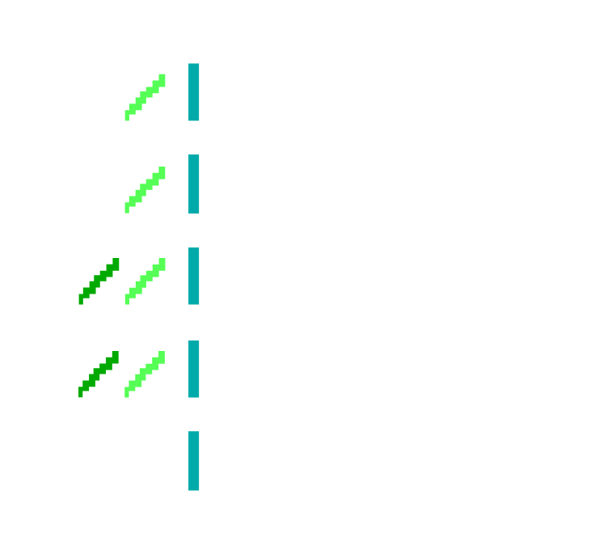

<p align="center">

</p>

# ansible-role-greenbone 

Adopts an existing Greenbone Community Edition Compose stack for the Little Cedar MASH playbook.

## What it does

- Uses Compose project `greenbone-community-edition`
- Default path: `/opt/siem/greenbone`
- Publishes HTTPS on host port **9443**
- Refreshes feed data daily at 03:15 with `greenbone-feed-sync.timer`
- Prunes dangling images after that sync
- Copies `compose.yaml` only when the host does not already have one

## What it leaves in place

Existing scans, reports, and the `pg-gvm` database stay on their current volumes. The role does not delete volumes.

`greenbone_enabled` defaults to false. A host has to set it to true before the role runs. On Centurion that pair is:

```yaml
greenbone_enabled: true
greenbone_base_path: /opt/siem/greenbone
